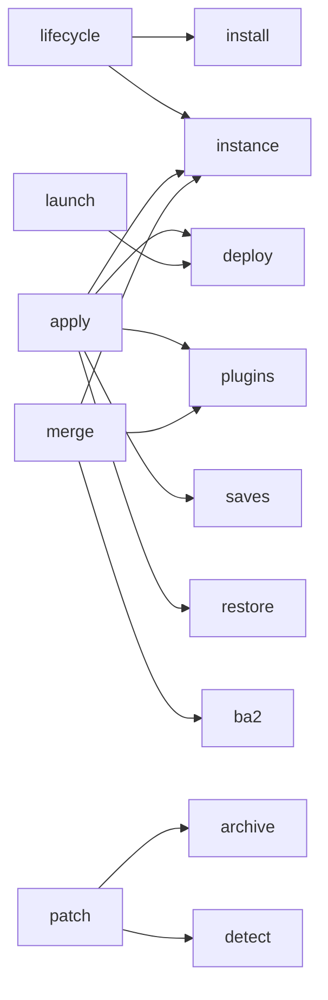

# overseer-core

`overseer-core` is the UI-agnostic domain layer shared by every Overseer front end. It owns
instances, profiles, mod installation, deployment, plugin state, saves, game inspection, archive
merging, and binary patching. It does not print to the terminal or depend on CLI and UI crates.

The crate is synchronous. Front ends decide where long-running work runs and how deployment
progress is presented. Persistent state remains file-based: instances use TOML, profiles use
MO2-compatible text and INI files, and live operations use JSON records where recovery or
restoration requires them.

## Source layout

The crate root exposes eighteen public production modules. Two private modules provide shared error
and filesystem support, while a conditional `test_support` module provides shared fixtures.

```text
crates/overseer-core/
|-- Cargo.toml
|-- README.md
`-- src/
    |-- lib.rs          Public crate surface
    |-- apply/          Live deployment orchestration and recovery
    |-- archive.rs      Bounded BA2 header inspection
    |-- ba2.rs          Full BA2 extraction and repacking
    |-- deploy/         Deployment planning, backends, and reversal
    |-- detect/         Game installation and edition detection
    |-- error.rs        Shared path-aware I/O errors
    |-- f4se.rs         Static F4SE plugin inspection
    |-- fs.rs           Shared filesystem operations
    |-- game.rs         Supported-game capability data
    |-- ini.rs          Bethesda INI parsing and editing
    |-- install/        Archive extraction and staging
    |-- instance/       Instance and profile persistence
    |-- launch.rs       Backend-aware executable launching
    |-- lifecycle/      Installed-mod transactions
    |-- merge/          BA2 merging and managed merge state
    |-- patch/          Binary patch mechanisms and game policy
    |-- plugins/        Plugin discovery and load-order management
    |-- restore.rs      Content-aware restoration
    |-- saves/          Save discovery and profile redirection
    |-- settings.rs     Application-level settings
    `-- test_support.rs Shared test fixtures and testbeds
```

## Main relationships

The arrows below mean that the module on the left coordinates or uses the module on the right. They
show the primary ownership boundaries, not every internal dependency.



`lifecycle` is the only installed-mod publisher, while `install` supplies crate-private archive
preparation.
`apply` owns the live deployment transaction, while `deploy` owns file planning and backend
mechanics. `merge` and `patch` are separate transformation systems: merging rebuilds mod archives,
while patching verifies and replaces existing game files.

## Module guide

### [`apply`](src/apply/mod.rs)

`apply` is the live-state orchestrator. It deploys a profile, purges an existing deployment,
reports deployment status, and guards mod and profile renames. It coordinates `instance`, `deploy`,
`plugins`, `saves`, and `restore` behind a per-instance lock.

Deployment state is journaled in `state/deployment.json`. Interrupted or incomplete reversals are
retried on the next apply operation, while user changes made after deployment are preserved where
the restoration logic can identify them.

### [`archive`](src/archive.rs)

`archive` performs cheap, bounded BA2 inspection. It reads the fixed 24-byte BTDX header and reports
the archive version, entry count, and content kind without reading or decompressing the payload.
Diagnostics and patch planning use it when full extraction would be unnecessary.

### [`ba2`](src/ba2.rs)

`ba2` performs full BA2 extraction and Fallout 4 version-1 repacking through `btdx`. It handles
general files and DX10 textures as separate payload types and requires usable archive paths for
every entry. The merge engine uses it to unpack sources and build deterministic output archives.

### [`deploy`](src/deploy/mod.rs)

`deploy` owns the filesystem deployment engine. It resolves case-insensitive file conflicts with
last-writer-wins priority, maps normal staging content into `Data/`, maps `Root/` content beside the
game executable, and records enough information to verify or reverse the result.

The `Deployer` trait keeps backend behavior replaceable. Hardlinks are the implemented production
backend. USVFS and ProjFS remain represented as unsupported backend choices so configuration and
deployment records already have a stable backend identity.

### [`detect`](src/detect/mod.rs)

`detect` identifies game installations, storefronts, executable versions, and Fallout 4 editions.
It recognizes Steam, GOG, Epic, and Microsoft Store markers and reads Windows PE version resources
without requiring a configured Overseer instance.

For Fallout 4, it also provides the Old-Gen, Next-Gen, and Anniversary generation vocabulary shared
by patching, F4SE inspection, diagnostics, and Address Library naming.

### [`f4se`](src/f4se.rs)

`f4se` statically inspects F4SE plugin DLL bytes without loading or executing them. It recognizes the
legacy and modern F4SE exports, reads bounded version metadata, and reports compatible runtimes and
version-independence flags. Diagnostics uses these facts to evaluate plugin compatibility.

### [`game`](src/game.rs)

`game` is the capability table for supported games. `GameKind` currently represents Fallout 4,
Skyrim Special Edition, and Starfield, while accessors provide executable names, store IDs, INI
locations, plugin-library identifiers, script-extender paths, save formats, and engine limits.

Not every capability is implemented for every game. Fallout 4 currently has the complete save,
plugin-limit, archive-limit, detection, and patching data used by the rest of the crate.

### [`ini`](src/ini.rs)

`ini` provides a deliberately limited Bethesda INI reader and content-preserving key editor. It
supports section and key lookup, overlays custom settings onto base settings, and updates selected
keys without rewriting unrelated comments or assignments. Profiles, save redirection, and
diagnostics share this implementation.

### [`install`](src/install/mod.rs)

`install` is the low-level archive layer. It recognizes ZIP and 7z downloads, checks declared
expansion size, extracts into staging, finds the actual content root, and rejects unsupported FOMOD
layouts or reserved Overseer metadata. Candidate preparation is crate-private; `lifecycle::install`
is the sole public path that publishes a prepared tree under `mods/`.

### [`instance`](src/instance/mod.rs)

`instance` defines Overseer's persistent instance and profile model. An instance owns
`overseer.toml` plus the `mods/`, `profiles/`, `downloads/`, `overwrite/`, and `state/` directories.
Profiles own MO2-compatible `modlist.txt` files, local-save settings, and the ordered mod state used
by deployment.

The module also validates names, resolves instance paths, stores configured executables, manages
profile priority, and reconciles profile entries with installed staging directories. Reconciliation
drops missing managed mods and appends newly discovered mods disabled at lowest priority.

### [`launch`](src/launch.rs)

`launch` resolves named executable entries from instance configuration and passes a complete launch
target to the selected deployment backend. This keeps process startup compatible with future
virtual filesystem backends. It does not deploy a profile or recover deployment state before
launching.

### [`lifecycle`](src/lifecycle/mod.rs)

`lifecycle` owns install, remove, and explicit replace operations. Install and replace accept only a
validated archive basename that already names a direct regular file under `downloads/`; they never
copy or import archives. Every operation holds the shared instance lock and refuses to run while
deployment state or prior lifecycle residue exists.

Operations use a fixed pending directory and collision-safe same-volume renames. Install and remove
commit when the live tree is renamed; replace retains exact in-process rollback for its two-tree
swap. Cleanup failures return committed residue explicitly, and interrupted operations require
manual, commit-forward resolution rather than claiming exact crash rollback. While residue exists,
installed-mod reads and profile persistence remain blocked so incomplete trees cannot be reconciled
away.

Lifecycle operations do not mutate profiles. Profiles discover installs disabled and discard
removed entries when they next reconcile.

### [`merge`](src/merge/mod.rs)

`merge` combines ranked BA2 sources into deterministic Fallout 4 archives, emits minimal carrier
ESL plugins, writes localized strings loose, and reports every resolved path conflict. The core
merge engine writes only beneath staging and remains independent of Creation Club selection.

The module also connects merged output to an Overseer instance. Managed merge state is recorded in
JSON manifests, source archives are backed up, generated output becomes a managed mod, and an
explicit restore operation can reverse the merge.

### [`patch`](src/patch/mod.rs)

`patch` contains game-independent binary patch mechanisms and Fallout 4 policy. Its generic pieces
inspect and map VCDIFF files, decode deltas, fingerprint source and target files, stage verified
output, retain backups, and replace files only after the reconstructed target matches a trusted
identity.

Fallout 4 policy supplies BA2 edition rules, core-binary fingerprints, DLC consistency targets, and
the bundled Creation Club catalog. A multi-file conversion uses verified temporary files and atomic
renames, but the complete batch is not one journaled transaction.

### [`plugins`](src/plugins/mod.rs)

`plugins` owns plugin discovery, header metadata, per-profile load order, presentation separators,
carrier generation, and synchronization with the game's real `Plugins.txt`. It uses `esplugin` for
metadata and `libloadorder` for the live game state.

The module keeps managed intent separate from live state. Each profile has its own `plugins.txt`,
the game has its actual `Plugins.txt`, and optional `separators.txt` data affects presentation
without changing activation or deployment.

### [`restore`](src/restore.rs)

`restore` provides the shared rule for reversing external state without erasing later user changes.
It restores an original value only when the current value still matches what Overseer wrote.
Plugins and profile-local save redirection use this result to distinguish a completed restoration
from a preserved conflict.

### [`saves`](src/saves/mod.rs)

`saves` lists game saves, reads bounded Fallout 4 metadata, deletes saves with their script-extender
co-saves, and manages profile-local save redirection through `SLocalSavePath`. Listing treats
malformed metadata as a per-save problem rather than failing the entire directory.

Save redirection is coordinated by `apply` so the previous INI value can be restored during purge
or deployment recovery.

### [`settings`](src/settings.rs)

`settings` owns application-level configuration outside any one instance. It stores recent instance
paths and save or download sort preferences in an open TOML schema. Loading tolerates missing and
unknown fields, saves atomically, and preserves malformed configuration through a best-effort
`.bak` move before falling back to defaults.

## Internal support

### [`error`](src/error.rs)

The private `error` module defines `IoError`, which attaches a UTF-8 path to an underlying operating
system error. Domain modules wrap it in their own typed errors so filesystem failures consistently
identify the affected path.

### [`fs`](src/fs.rs)

The private `fs` module centralizes path-aware filesystem operations. It provides optional reads,
atomic writes, parent creation, durable cross-volume moves, idempotent removal, chunked file reads,
and corruption backup without giving those mechanics separate implementations in every domain
module.

## Testing support

[`test_support`](src/test_support.rs) provides synthetic plugins, saves, BA2 headers, archives,
temporary instances, profile helpers, and reusable testbeds. It is compiled for core tests or when
the `test-support` feature is enabled. It is test infrastructure rather than a production domain
module.
